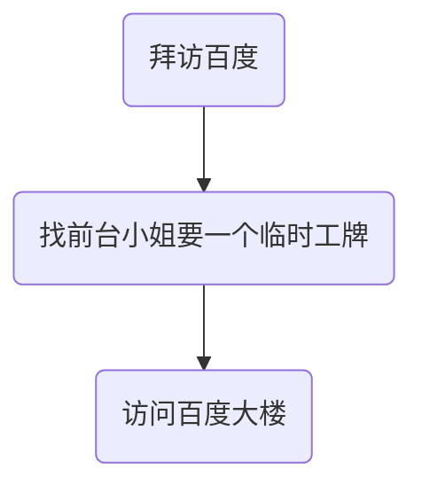
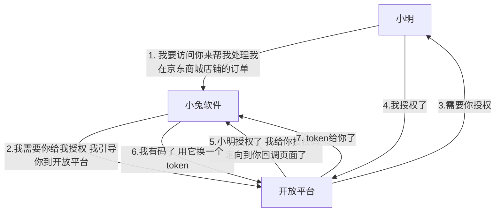

# OAuth2.0

## OAuth2.0是什么

那总结来说，OAuth 2.0 这种授权协议，就是保证第三方（软件）只有在获得授权之后， 才可以进一步访问授权者的数据。因此，我们常常还会听到一种说法，OAuth 2.0 是一种 安全协议。现在你知道了，这种说法也是正确的。

## OAuth 2.0 是怎样运转的？

现在，我相信你已经对 OAuth 2.0 有了一个整体印象，接下来咱们再看看它是怎么运转 的。 我们还是来看上面提到的小兔打单软件的例子吧。假如小明在京东上面开了一个店铺，小明 要管理他的店铺里面的订单，于是选择了使用小兔软件。 现在，让我们把“小明”“小兔软件”“京东商家开放平台”放到一个对话里面，看看“他 们”是怎么沟通的吧。

